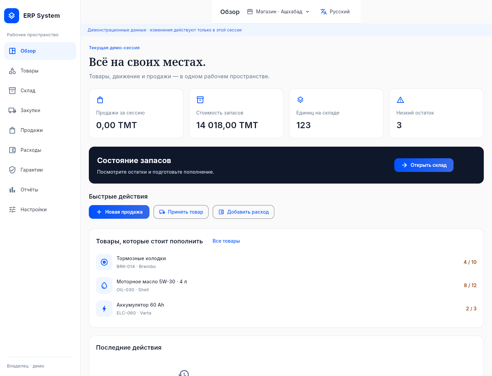

# ERP System

Inventory ERP for shops in Turkmenistan, with Russian and Turkmen interfaces. Android tablets are the first target; iPad and iPhone follow later. A Flutter app (`mobile/`) talks to a Django REST API on PostgreSQL (`backend/`); the delivery plan is in [PLAN.md](PLAN.md).

## What is included

- **Real build (default):** sign-in against the Django API, session restore, restart-safe pending operations, administration (business, locations, staff, language, USD→TMT rate), the product catalog with camera barcode scanning, stock (ledger with FIFO costs, opening stock, adjustments, history), suppliers, purchase orders and partial deliveries, and sales: the seller sets the quantity and price of every line (prices are not fixed), cash or card, optional customers, sales history, and one plain receipt as a PDF in Russian or Turkmen, with a restart-safe save; transfers between locations (goods wait in transit, are received in full or short with a reason, or sent back) and stock counts (a person counts, an owner or manager approves, the differences go through the ledger); customer returns against a sale (each product has its own return period; the refund is the price that was charged; goods come back as sellable, damaged or awaiting inspection at the cost they were sold at), returns to suppliers, a reorder list that becomes a draft purchase order; expenses with an optional photo of the receipt; warranty claims (repair, replacement, refund or rejection, an expired warranty only accepted by an owner or manager with a note); and CSV import and export of the catalog (the whole file is checked first; an invalid file changes nothing). The dashboard (today's and the month's sales, gross profit, expenses, stock value, items below their minimum, open orders and claims, recent activity: each only for the roles that may see it) and the Reports page (summary, sales, stock, purchasing, returns, expenses, each with a CSV export, and the activity history; owners and managers) read the real figures: revenue, refunds, net sales, cost of goods, gross profit, expenses and the result are separate measures, and the result is not an accounting profit.
- **Demonstration build** (`--dart-define=DEMO_MODE=true`): the earlier interface prototype with dashboard, products, inventory, purchasing, sales and returns, expenses, warranties, reports and administration screens on in-memory sample data, three demonstration locations and a searchable car-part catalog.
- Persistent language selection, ARB translations, and custom Turkmen delegates for the controls used here.
- Bundled Inter and Noto Serif fonts, their licenses, and Android and web platform scaffolds.

The visible demonstration banner is intentional. In the demonstration build operations change sample data in memory and reset when the application restarts; warranty cards are examples, and transfers complete immediately (the production transfer workflow will track dispatch, transit and receipt). A dedicated receipt printer and backups are not connected. Photos and files go to a private folder on the server (`PRIVATE_FILES_ROOT`) that must be backed up with the database. Payments are only recorded as cash or card (no gateway, no change, no tax, no invoices). This is an ERP, not a cash register. TMT is the business currency (decided); selling prices may be stated in TMT or USD. Turkmen terminology needs fluent-speaker review.

## Interface preview



[View the Turkmen dashboard](docs/images/dashboard-tk.png).

## Toolchain

Flutter **3.47.6**, pinned in `.flutter-version`, from official commit `5fc346839b5d0eef006ed8404392afb4dfae428d`. Android uses the corresponding Flutter templates, Android API 36, and the Gradle wrapper's pinned distribution checksum. The cloud setup installs a complete Temurin Java 21 JDK.

## Run on your development machine

Install the pinned Flutter SDK and the Android SDK appropriate to your workstation, then select an attached Android device or emulator:

```bash
cd mobile
flutter pub get
flutter gen-l10n
flutter devices
flutter run -d <android-device-id>
```

To try the same Flutter interface in an installed Chrome browser:

```bash
cd mobile
flutter run -d chrome
```

The debug Android APK and web build have been verified. Installation on physical Android hardware remains to be tested. iOS platform generation and validation are deferred to the Apple stage and require macOS/Xcode or a suitable build service.

## Cloud setup and validation

From `/workspace/ERP-System`:

```bash
bash scripts/setup_cloud.sh
source scripts/cloud_env.sh
cd mobile
dart format lib test
flutter analyze
flutter test
flutter build web --no-web-resources-cdn
flutter build apk --debug
```

The setup helper reuses the pinned SDK, installs missing Android prerequisites, and uses frozen dependency resolution with the retained application lockfile. The pinned Android command-line tools handle licensing without a separate prompt. It does not scaffold over application code. Keep `mobile/pubspec.lock` with the application.

Cloud Java clients use the environment's existing proxy and its provided public CA while retaining TLS verification. Because Maven Central rate-limits the shared cloud egress address, the helper configures Google's public Maven Central mirror inside the cloud Gradle cache. Workstation and project repository settings are unaffected. The web build bundles rendering resources locally.

For an internal cloud smoke run after the web build:

```bash
cd /workspace/ERP-System/mobile/build/web
python -m http.server 8080 --bind 127.0.0.1
```

Use internal browser requests for validation. The onboarding UI does not provide a localhost application preview.

### Claude Code cloud

The helpers above assume the Codex cloud (`/workspace` paths). In a Claude Code cloud session, run `bash scripts/setup_claude_cloud.sh` once, then `source scripts/claude_cloud_env.sh` before Flutter commands. The setup installs the pinned Flutter SDK under `~/.tools` and supports the format, analysis, test, and web build commands above. It omits Android because `dl.google.com` is blocked by that environment's default network policy; see `HANDOFF.md`.

### Backend and CI

The Django API lives in `backend/` (Python 3.13, Django 5.2 LTS, Django REST Framework, PostgreSQL). Commands, environment variables and the local PostgreSQL helper are in [AGENTS.md](AGENTS.md); deployment files are in `infra/`. GitHub Actions (`.github/workflows/ci.yml`) runs the Flutter checks plus a debug Android APK build, the backend checks against PostgreSQL, and a container image build on every push and pull request.

The app starts at sign-in and talks to the API at `API_BASE_URL` (`--dart-define=API_BASE_URL=https://...`; debug builds default to `http://127.0.0.1:8000`). For the in-memory demonstration instead, build with `--dart-define=DEMO_MODE=true`. Never present the demonstration as real functionality.

### Current validation status

The exact results of the last checks, and what has **not** been verified, are in [HANDOFF.md](HANDOFF.md) section 4. In short: the app's format, analysis and tests, the backend's lint, checks and PostgreSQL tests, the web build, and (in GitHub Actions) the debug Android APK and the container image build all pass. Camera scanning on a real tablet, a deployed staging server, real email delivery, TalkBack and iOS have not been verified.

Build artifacts are `mobile/build/web/` and `mobile/build/app/outputs/flutter-apk/app-debug.apk`. These are ignored outputs and can be recreated with the commands above. The Android APK uses development signing; it is not a store release.

## Project documents

- [Product requirements](docs/PRD.md)
- [Delivery plan](PLAN.md)
- [Current state and handoff notes](HANDOFF.md)
- [Agent instructions](AGENTS.md)
- [Design system](docs/DESIGN_SYSTEM.md)
- [Architecture and prototype boundaries](docs/ARCHITECTURE.md)
