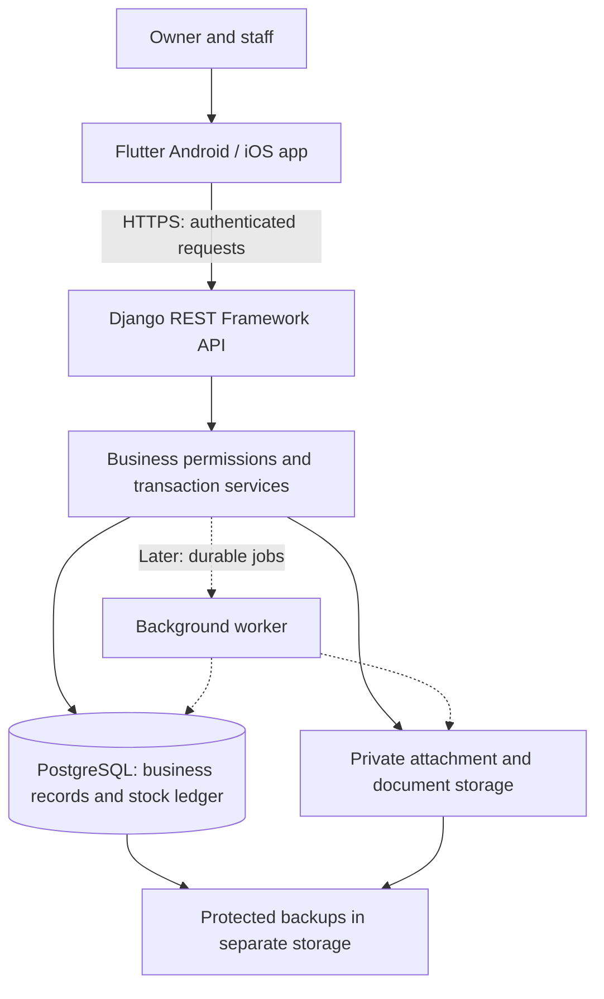

# Architecture

Status: The Flutter interface prototype is implemented. Analysis, 12 unit/widget tests, web and debug Android builds, APK signature verification, and interactive browser checks passed during prototype development. Physical Android hardware and iOS remain untested. Django REST Framework and PostgreSQL were confirmed as the backend and database on 2026-10-06. They, the authentication, and the deployment described below have not been implemented yet; [PLAN.md](../PLAN.md) sets the delivery order.

Product requirements live in [PRD.md](PRD.md), visual rules in [DESIGN_SYSTEM.md](DESIGN_SYSTEM.md), and development rules in [AGENTS.md](../AGENTS.md). This document describes how the agreed inventory ERP should fit together.

## System Overview

One shared Flutter application serves Android tablets first, then iPad and iPhone. Each business manages its own catalog, staff, stores, and warehouses. Staff devices connect to a central API; the server decides whether an operation is permitted and commits its effect on stock and financial records.

Proposed production system:



Start with a **modular monolith**: one backend application with separate business modules and one PostgreSQL database. This keeps a sale, its payment record, and its stock movements inside one database transaction. Separate microservices are unnecessary for the initial release.

Stock-changing actions require internet access. Optional cached views must show when they were last refreshed. An offline cart or saved draft must never appear to be a completed sale. Offline stock synchronization is outside the initial scope.

### What Runs Today

```text
Flutter widgets and shared theme
    ├── Generated Russian / Turkmen ARB strings
    ├── Custom Turkmen delegates for the toolkit controls used
    ├── Real mode (default build): sign-in -> workspace on the API
    │     ├── core/api: ApiClient (bearer token, one refresh, structured errors)
    │     ├── core/session: secure refresh token, profile, business and location choice
    │     ├── core/operations: pending-operation store + runner (restart-safe retries)
    │     ├── core/money: exact decimal text <-> integer hundredths/thousandths (no double)
    │     └── features/: auth, admin, catalog, scanning, inventory, purchasing, sales, transfers, counts, (later) returns...
    ├── SharedPreferences: interface language, last business/location ids,
    │     and unconfirmed-operation retry records (no tokens, no balances)
    └── Demo mode (--dart-define=DEMO_MODE=true, or an explicit DemoStore):
          sample catalog, balances, cart and session operations, with a visible banner

Django REST API (backend/)  ->  PostgreSQL
    apps/accounts (users, sessions, recovery) · apps/businesses (tenants, locations,
    roles, exchange rates) · apps/catalog (products, barcodes, units, reorder levels) ·
    apps/inventory (stock ledger, FIFO layers) · apps/purchasing (suppliers, orders,
    deliveries) · apps/sales (customers, sales, the receipt PDF) · apps/stockops (transfers, stock counts) · apps/audit (audit trail, idempotency) · apps/common (errors, request IDs)
```

Which pages are connected to the API is tracked in `PLAN.md` and `HANDOFF.md`. A real build shows an honest "later release" page for anything not connected yet; it never shows demo data as real.

`DemoStore` is a local demonstration implementation. Business records live in memory and reset when the app restarts. It does not provide production persistence, authentication, permissions, accounting, or offline sales. Transfers complete immediately in the demo; production transfers must track dispatch, transit, and receipt separately. Warranty cards are sample records.

## Tech Stack

| Area | Technology or approach | Status |
| --- | --- | --- |
| Shared client | Flutter and Dart; Android tablets first, Apple platforms later | Confirmed; Android/web prototype present |
| Client toolchain | Flutter 3.47.6, pinned in `.flutter-version`; dependencies in `mobile/pubspec.lock` | Implemented |
| State and UI updates | `ChangeNotifier` / `ListenableBuilder`, with shared theme/widgets (`AppShell` frames both demo and real workspaces) | Implemented |
| HTTP client | `package:http` behind `ApiClient`; the only code that talks to the server | Implemented (Phase 2) |
| Localization | Flutter-generated ARB strings for `ru` and `tk`, custom Turkmen toolkit delegates, bundled Inter and Noto Serif | Implemented for current screens; terminology review pending |
| Local preferences | `SharedPreferences` for interface language, the last business/location ids, and pending-operation retry records | Implemented; never a stock database or token store. The legacy API is used on purpose: on Android it writes with `commit()`, so an awaited write is durable (the newer async API uses `apply()`); re-check before changing it |
| Backend | Python 3.13, Django 5.2 LTS (supported to April 2028), Django REST Framework 3.18; pinned in `backend/uv.lock`, managed with `uv`; lint/format with `ruff` | Foundation implemented (Phase 1) |
| Database | PostgreSQL 16 (tests and CI run against it; SQLite is unsupported) | Implemented |
| Authentication | Django user accounts and business memberships; `djangorestframework-simplejwt` (access 15 min, rotating blacklisted refresh 14 days, instant revocation on password change through a per-user session version); emailed one-time recovery codes | Implemented (Phase 1). Email provider (D16) still to choose |
| Mobile session storage | `flutter_secure_storage` (Android Keystore / Apple Keychain) holds only the refresh token | Implemented in code (Phase 2); Android runtime behavior is verified only by the CI build until a device test |
| Attachments and PDFs | Private file/object storage; server-generated documents with bundled fonts | Planned; provider and PDF library undecided |
| Background jobs | Celery with Redis if long-running imports, reports, or scheduled work require it | Future option; not needed to run the prototype |
| Monitoring | Structured server logs, health metrics, and error reporting | Planned; provider undecided |
| Payment handling | Record payment method and amounts; no payment gateway | Initial product scope |

Backend and client dependencies are pinned (`backend/uv.lock`, `mobile/pubspec.lock`); add a dependency only through those manifests. No Redis, payment, storage or monitoring provider is connected yet. Keep the existing client state approach unless a concrete workflow justifies changing it.

## Project Structure

### Existing Files

| Path | Responsibility |
| --- | --- |
| `mobile/lib/main.dart` | Startup, language preference, localization delegates, and the choice between demo and real mode |
| `mobile/lib/core/` | `config/` (build-time settings), `api/` (client, errors, error-code translation), `session/` (secure token store, profile, business/location choice), `operations/` (restart-safe pending operations), `money/` (exact decimal parsing and formatting), `format/`, `connectivity/` |
| `mobile/lib/features/` | Real-mode screens by feature: `auth/` (sign-in, password recovery), `admin/` (business profile, locations, staff, language, exchange rate), `catalog/` (list, detail, form, reference pickers), `scanning/` (camera scanner behind the `BarcodeScanner` interface, `BarcodeInput`), `inventory/` (stock list, history, opening stock and adjustments), `purchasing/` (suppliers, orders, receiving), `workspace/` (real workspace, placeholders, unsaved-work guard), `operations/` (pending-operation banner), `shared/` (loading/error widgets) |
| `mobile/lib/demo/` | Sample records and in-memory demonstration operations |
| `mobile/lib/screens/` | The demonstration workspace and its dashboard, products/inventory, sales, and management screens |
| `mobile/lib/widgets/` | Shared visual components, dialogs, display helpers, and `AppShell` (navigation and header used by both workspaces) |
| `mobile/lib/theme/` | Flutter theme and semantic colors |
| `mobile/lib/l10n/` | Russian/Turkmen ARB files, generated strings, and Turkmen adapters |
| `mobile/assets/fonts/` | Bundled fonts and licenses |
| `mobile/test/` | Demo behavior, core (API client, session, operation runner), real-mode widget, and translation-parity tests |
| `backend/` | Django REST API: `config/`, `apps/{common,accounts,businesses,catalog,inventory,purchasing,audit}/`, Dockerfile |
| `infra/` | Container stack and the staging runbook (no deployment is performed by the repository) |
| `.github/workflows/` | CI for the app, the backend and the container image |
| `mobile/android/` | Android host and checksum-pinned Gradle wrapper |
| `mobile/web/` | Browser host for reviewing the same Flutter interface |
| `scripts/` | Cloud tool activation and reproducible setup helpers |
| `docs/` | Product requirements, design system, and architecture |

The browser host supports development review. It does not introduce a separate desktop ERP product. An iOS host has not yet been generated.

### Proposed Additions

These paths are a plan, not existing directories (`core/`, `features/{auth,admin,catalog,scanning,inventory,purchasing,workspace,operations,shared}` and `backend/apps/{common,accounts,businesses,catalog,inventory,purchasing,audit}` already exist). Add the rest as their workflows are implemented rather than creating empty abstractions in advance.

```text
mobile/lib/
    features/               # Feature models, repositories, controllers, screens
        sales/
        ...

backend/
    config/                 # Django settings, URLs, environment configuration
    apps/
        # inventory/ and purchasing/ exist; transfers, counts and supplier returns are added to them later
        sales/              # Customers, sales, recorded payments, refunds
        expenses/           # Expense categories, entries, receipt links
        warranties/         # Entitlement snapshots and claim workflows
        reporting/          # Authorized reports and reorder calculations
        documents/          # The receipt PDF, attachment access
        imports/            # CSV validation, previews, application jobs
        audit/              # Activity history and operation identities
    tests/                  # Cross-module and PostgreSQL integration checks

infra/                      # Deployment configuration, added when selected
```

In the backend, API serializers validate request shape, application services coordinate business rules and transactions, and models/migrations define persistent records and constraints. Modules call services rather than independently changing inventory balances.

## Frontend and Localization

The client follows this boundary as production workflows are added:

```text
Screen → controller/state → feature repository → API client → server
```

Widgets display state and collect input. Repositories map server responses into typed models. The API client centralizes authentication, timeouts, pagination, and structured errors. Demo data remains explicitly separate from API-backed records; saving `DemoStore` balances into preferences is not a production persistence strategy.

- Show loading, empty, validation, success, and failure states. Disable duplicate submission while a command is pending.
- **Restart-safe commands.** Every stock-changing action goes through `OperationRunner`. It saves a `PendingOperation` (operation key, action, business, path, body) on the device **before** sending, sends it with the key as `Idempotency-Key`, and removes the record only on a definite answer (2xx, or a 4xx refusal that changed nothing). After a timeout, a 5xx, a crash or a restart the record stays; the app asks the server what became of that key and only ever retries with the **same** key. A key the server has never seen is listed as such and the user chooses to retry or discard; nothing is re-sent behind their back. Records are private to the signed-in user, hold no tokens or balances, and an ended session keeps them so the action can be sent after signing in again. Tests cover "server committed, answer lost, app restarted, exactly one record".
- The server confirms a sale, receipt, transfer, or refund before the UI shows completion. A cart does not reserve stock in the initial model; checkout rechecks availability.
- Cache only appropriate reads initially, keyed by business, location, and user access. Clear private cache/session state on logout or account changes. Preserve drafts across language switching.
- Keep all system strings in Russian/Turkmen ARB resources. User-entered product names and identifiers remain unchanged when the interface language changes.
- Treat interface language, business currency, document language, and business timezone as separate settings. Store timestamps in UTC and report dates using the configured business timezone.
- Use decimal-safe parsing and explicit currency precision. The demo uses integer minor units and illustrative TMT amounts; production currency, rounding, and tax rules still require confirmation.
- Custom Turkmen delegates cover current controls because the pinned Flutter SDK lacks built-in `tk` delegates. Audit and extend them before adding date/time pickers: inherited English picker formatting is not approved for release.
- Review Russian/Turkmen terminology with fluent speakers and verify fonts in PDFs and printing as well as on screen.

## API and Data Flow

Use a versioned REST API, provisionally `/api/v1/`. Public resource identifiers should be stable, preferably UUIDs. Server-generated document numbers are separate from identifiers and follow the eventual business/legal numbering policy.

### Completing a Sale

1. Staff select an authorized location and add products to a cart. The client validates required input and displays an estimated total.
2. The client submits the sale command over HTTPS with authentication and a unique operation/idempotency key. It retains that key until the outcome is known.
3. The API verifies the session, business membership, location access, and permission to sell. Client-supplied business IDs never establish access.
4. Inside a PostgreSQL transaction, the service claims the operation key, locks affected stock rows in a consistent order, rechecks quantities, and calculates authoritative totals from the prices the seller set.
5. The service creates the sale, item/price snapshots, recorded payments, stock movements, balance changes, and audit entry together. Any validation failure rolls the transaction back.
6. After commit, the API returns the finalized sale and updated values. The client updates the UI and offers the receipt. PDF generation can retry separately without completing another sale.

**Implemented (Phase 5), see "Sales and the receipt (implemented)" below.** Differences from the generic flow above: the client sends the product, the quantity and **the unit price the seller chose** for every line, plus cash or card; the server does not reprice (prices are not fixed) and refuses only a negative price; there is no tax, discount or payment amount; and the cart reserves no stock, so step 4 can refuse with `insufficient_stock` (naming the product).

If the connection times out, the outcome may be unknown. Query the operation status or retry with the **same key**; a new key could create another sale. Idempotency records use a unique business/actor/action/key scope and a request fingerprint. Reusing a key with a different payload is rejected. Concurrent duplicate requests return one committed outcome.

### Reads and Errors

Lists support pagination, permitted location/date filters, and indexed search. Financial fields are filtered on the server, not merely hidden in the interface.

Return structured errors such as `code`, message parameters, field errors, and a request ID. The client translates error codes using its selected language. Distinguish validation errors, expired sessions, denied access, stock conflicts, and temporary service failures. Do not expose server tracebacks or another business's records.

## Database and Storage

### Main Records

| Domain | Principal records and relationships |
| --- | --- |
| Business access | Business, location, user, membership, role, permitted locations |
| Catalog | Product, category, brand, unit, barcode, product/location reorder settings |
| Inventory | Stock movement, stock balance by location and condition, transfer/items, count/items, approved adjustment |
| Purchasing | Supplier, purchase order/items, delivery/items, supplier return |
| Sales | Customer, sale/items, recorded payment, linked return/items, recorded refund |
| Expenses | Expense, category, location, private receipt attachment |
| Warranties | Sale-item warranty terms snapshot, claim, status history, resolution |
| Operations | Idempotency record, audit event, document metadata, import job |

Use foreign keys, tenant-aware relationships, and uniqueness constraints for identifiers such as business SKUs and barcodes. Every business-owned record carries a business scope; related products, locations, documents, and transactions must belong to that same business. Users may have separate memberships in several businesses.

A shared database with business-scoped records is the proposed first deployment. Authorization filters and relationship validation apply to API reads/writes, reports, downloads, imports, and jobs. Test isolation directly; adding a `business_id` column alone does not enforce it.

### Stock Ledger and Transaction Integrity

- The stock movement ledger is the historical source for inventory changes. Each entry identifies business, product, location/condition, quantity change, originating document, actor, and timestamp.
- Maintain current balance rows transactionally for fast availability checks. Reconcile them against the ledger; never allow an ordinary endpoint to overwrite a balance without an explained movement.
- Use PostgreSQL row locks, uniqueness/check constraints, and atomic transactions to prevent overselling and duplicate posting. Lock rows in a consistent order and test competing requests against PostgreSQL.
- Finalized transactions and movements retain history. Corrections create linked reversals or adjustments. Application permissions prevent ordinary users from rewriting posted history.
- Sellable, damaged, awaiting-inspection, and in-transit quantities remain distinct. Only sellable stock is available for sales; negative availability is disallowed initially.
- Purchase orders do not increase stock. Actual receipts do, including partial deliveries; retain remaining quantities and prevent duplicate receipt posting.
- A transfer dispatch removes source availability and records goods in transit. Receipt adds the actual received quantity at the destination and reduces transit quantity. Cancellation and discrepancies require explicit transitions and reasons.
- Counts retain their baseline, measurement times, and movement/version context. Detect movements during counting and require reconciliation or a defined movement pause before approval. Never blindly overwrite the latest balance with an earlier count. The pilot's exact count policy remains to be selected.
- Returns lock and validate the original sale items so concurrent requests cannot exceed remaining returnable quantities. A refund is exactly what the customer was charged for the returned goods (prices are not fixed, there are no discounts or taxes); any seller may refund (owner, 2026-10-07). Only goods accepted as sellable replenish availability.
- Warranty terms are copied onto finalized sale items. Later catalog edits must not change an existing entitlement; a replacement or other stock effect posts through the inventory service.

### Catalog (implemented)

- Products belong to one business: SKU unique per business (case-insensitive), any number of barcodes, each unique per business, unit of measure, optional category and brand, `warranty_months` (0 = none) and free-text `warranty_terms` (D8a). Archive (`is_active=false`) replaces delete, so history keeps pointing at the product.
- A unit's decimal places (0-3) cannot be changed once a product uses it (`unit_in_use`, 409); quantities are validated against the unit's precision wherever they are accepted. Default Russian/Turkmen units are created with each business; the Turkmen names are provisional.
- Search runs on a maintained case-folded `search_key` (name, SKU, brand, category, barcodes) so Cyrillic and Turkmen letters match regardless of the database locale; it is paginated (`limit`/`offset`). `GET .../barcodes/lookup/?code=` is read-only and answers `barcode_not_found` (404) for an unknown code.
- The selling price carries its own currency (TMT or USD). The API returns the stated price, `price_tmt` at the current rate (null when a USD price has no rate) and `price_rate_missing`. The default purchase cost (TMT) is removed by the server for roles without `catalog.cost.view`; the client also never sends it for them.
- `ExchangeRate` (in `apps/businesses`) is an append-only history guarded by a database trigger: a rate is never edited, a new entry supersedes the old. Entering one needs `exchange_rate.manage` (owner, manager). Rates have up to 6 decimals; conversion rounds half up to 2 decimals using integer arithmetic. Each sale line keeps the rate used (`usd_rate`) and the converted price.
- Every create, change and archive writes an audit event. Reorder levels (minimum/target per product and location) feed the reorder suggestions (Phase 7). A product also has `return_days` (empty = no limit, 0 = not returnable), copied onto each sale line like the warranty.
- In the app, money and quantities are parsed from and sent as exact decimal text (`core/money/decimal_math.dart`); `double` is never used for amounts.

### Stock ledger, purchasing and receiving (implemented)

- **One writer.** `apps/inventory/services.post()` is the only code that creates stock movements, balances or cost layers (a test scans the source to keep it that way). Opening stock, adjustments, purchase receipts, sales, transfers, count approvals, customer and supplier returns, return inspections and warranty replacements call it. Admin screens for these tables are read-only.
- **Three tables, one invariant.** `StockMovement` is append-only (PostgreSQL trigger plus an ORM guard). `StockBalance` holds the current quantity per product, location and condition (`sellable`, `damaged`, `inspection`, `in_transit`) with a `CHECK quantity >= 0`. `CostLayer` holds one FIFO layer per incoming line (`CHECK 0 <= remaining <= initial`). `reconcile()` (and `manage.py reconcile_stock`) proves balance = sum of movements = sum of layer remainders, and that each layer equals its own movements. Every backend scenario test finishes by asserting it returns no differences.
- **FIFO (D6).** Outgoing goods consume the oldest layer first and record one movement per layer slice, each with that layer's exact unit cost, so the cost of a sale is known per slice. Opening stock and receipts each create a layer at their own unit cost (TMT).
- **Locking.** A posting creates missing balance rows (`INSERT ... ON CONFLICT DO NOTHING`), then locks the balances one by one in sorted order, then the layers oldest first. A shortfall is `insufficient_stock` (409) and nothing is written. Tests run real threads: two outflows of the last unit, twelve outflows of five units, concurrent first receipts of a new product, and opposite lock order.
- **Opening stock** (`stock.opening.post`): quantity and unit cost per line, allowed once per product and location (afterwards use adjustments); **adjustments** (`stock.adjust`): increase (with a cost) or decrease, per condition, with a mandatory reason stored on every movement. Both run inside `run_idempotent` (actions `stock_opening`, `stock_adjust`). Owner and manager only, provisionally (D7).
- **Reads.** `GET .../stock/` (balances; `value` and `average_cost` only with `stock.cost.view`; only the caller's locations) and `GET .../stock/movements/` (`stock.history.view`; `unit_cost` only with `stock.cost.view`). There is no endpoint that edits or deletes a movement.
- **Purchasing.** `Supplier`; `PurchaseOrder` numbered per business from a locked counter (`PO-0001`) with states draft, ordered, partially received, received, cancelled; lines carry quantity and unit cost (TMT). An order never changes stock. Draft orders can be edited; submit moves a draft to ordered; cancelling stops what is still outstanding and keeps what already arrived.
- **Receiving.** `POST .../purchase-orders/<id>/deliveries/` (`purchasing.receive`, action `purchase_receive`) runs in `run_idempotent`: the order and its lines are locked, receiving more than is outstanding is refused (`over_receipt`), the `Delivery` rows are append-only, and the goods enter stock at the order's location at the line cost through the inventory service. Concurrent copies of one receipt produce one delivery; concurrent receipts with different keys cannot exceed the order. The warehouse role receives goods but never sees costs: cost fields are removed from order, delivery, stock and history responses on the server.
- **Restart safety (end to end).** The app saves the request and its key before sending and clears it only after a definite answer. After a lost answer the app asks `GET .../operations/purchase_receive/<key>/`; a resend always reuses the key. Verified in widget tests (answer lost then app restart; a 5xx before commit resent with the same key) and in a real browser run against the real backend (HANDOFF section 4).

### Sales and the receipt (implemented)

- **Records (`apps/sales`).** `Customer` (optional: name, phone, notes, active flag); `Sale` (number `S-000001` per business from the same locked `DocumentCounter` as purchase orders, location, cashier, optional customer and a copy of the customer's name, `total`, `payment_method` cash or card, note, time); `SaleLine` (product with SKU and name copied, quantity, the unit's symbol and decimals, **`unit_price` = what the seller charged**, `line_total`, the catalog price and currency at that moment for reference, `cost_total` from the FIFO slices, and the product's **`warranty_months` and `warranty_terms` as they were at the sale**). Sales and lines are append-only (ORM guard plus PostgreSQL trigger), so a later catalog or price edit never changes a past sale. A mistake is corrected by a return (Phase 7), never by editing.
- **Prices are not fixed (owner, 2026-10-07).** The catalog price is only the app's starting suggestion. Every line carries the seller's `unit_price` (TMT, two decimals, zero or more); the server does not compare it with the catalog, so selling below cost or at zero is allowed (the owner then sees a loss in the history). There are no discounts, no `expected_total`/`price_changed` check and no currency conversion at sale time (a USD-priced product with no exchange rate can still be sold at a typed price).
- **The command.** `POST .../sales/` (`sales.create`, action `sale_complete`) runs inside `run_idempotent` in one transaction: it checks the location is the caller's and active, rejects archived products and duplicate lines, validates quantities against the unit's precision, computes `line_total = round_half_up(quantity x unit_price)`, posts the negative lines through `inventory.post` (movement type `sale`, document type `sale`; `insufficient_stock` 409 names the product), writes the sale and lines and an audit event, and takes the receipt number **last**, so the counter lock is brief and a failed attempt leaves no gap in the numbers. `payment_method` is `cash` (default) or `card`: only how the customer paid is recorded. There is no tax, no change, no amount tendered and no split payment: this is an ERP, not a cash register.
- **Reads.** `GET .../sales/` (`sales.view`; filters for location, dates, number text, cashier; only the caller's locations) and `GET .../sales/<id>/`. `cost_total` per line and the sale's cost and profit are removed by the server unless the role has `sales.cost.view` (owner, manager); profit can be negative. Customers: list with search, create, edit (`customer.view`, `customer.manage`). After a lost answer: `GET .../operations/sale_complete/<key>/`.
- **The receipt.** `GET .../sales/<id>/document/[?lang=ru|tk]` returns one `application/pdf` (`sales.view`, location-scoped), an 80 mm roll measured in a first pass so the height fits. The language defaults to `Business.document_language` (a setting; the app sends none). Content: business name, address and phone (optional, edited in Settings), number, date, cashier, location, customer, each line as `quantity x price = sum` with the warranty months, the total, how it was paid, a note, a thank-you. ReportLab with **DejaVu Sans regular and bold vendored in `backend/assets/fonts/` (with its licence) and embedded in every file**, which covers Russian and the Turkmen letters Ä Ç Ň Ö Ş Ü Ý Ž. Fixed ru/tk label tables (the Turkmen is a draft). **No cost or profit ever appears.** File responses opt out of client content negotiation (`apps/common/negotiation.py`). Invoices, tax and a legal format were dropped by the owner.
- **App (`features/sales`).** The cart is a `CartController` owned by the workspace, so it survives page and language changes and is cleared on a location change (after confirmation) and on sign-out. Search and camera scanning (a scan only adds the product), live availability at the current location (a hint; the server decides), quantity by unit precision, **a price box on every line** (catalog price prefilled in TMT, empty for a USD price without a rate), optional customer with quick-add. Totals use integer hundredths. The last step shows the lines and total, **Cash | Card** (cash by default) and Complete sale, sent through `OperationRunner`. Outcomes: confirmed (number, total, and a Receipt row to print or share); refused (message, cart kept; `insufficient_stock` names the product); **unknown** (the cart is emptied because the saved record now owns that sale, and the pending banner lists it until the server confirms). Sales history (`sales.view`) lists with search and shows the detail and how it was paid, with cost and profit only when the server sent them. The receipt is fetched with `ApiClient.download` and handed to the `printing` package (system print or share dialogs) through an injectable `DocumentActions`.
- **Checks.** `reconcile()` for sales verifies that each sale's total equals the sum of its line totals and that the stock movements recorded for the sale add up to exactly the quantity its lines sold; it is asserted empty after every sales scenario, and `manage.py reconcile_stock` runs it together with the ledger and purchasing checks.

### Transfers and stock counts (implemented)

- **One writer, one queue.** Both go through `inventory.services.post()`. Transfer and count-approval postings run under one PostgreSQL advisory lock per business (`pg_advisory_xact_lock`): a cancel takes the destination's in-transit row and then the source's shelf while a dispatch takes them the other way round, and a test that repeats exactly that race gets a `deadlock detected` from PostgreSQL when the lock is removed.
- **Transfers (`apps/stockops`).** `Transfer` (number `T-0001`, from, to, status `dispatched`, `received`, `partially_received` or `cancelled`, who and when, discrepancy and cancel reasons) with `TransferLine` (quantity sent, quantity received). **Dispatch** (`POST .../transfers/`, `transfer.create`, needs access to the source) posts the goods out of the source's `sellable` stock (FIFO slices) and mirrors every slice into the destination's `in_transit` condition with the **same unit cost**, so cost layers travel with the goods and goods in transit are not sellable (never in two places). **Receive** (`.../receive/`, `transfer.receive`, access to the destination) takes the sent quantity out of in transit: what arrived becomes `sellable` at the same layer costs, what is missing is a `transfer_loss` movement carrying the mandatory reason (status `partially_received`). **Cancel** (`.../cancel/`, reason required, access to the source) returns everything to the source's shelf with its costs. All three are `run_idempotent` actions (`transfer_dispatch`, `transfer_receive`, `transfer_cancel`) and only work on a transfer that is still in transit (`transfer_not_receivable`, `transfer_not_cancellable` 409). Movement types `transfer_out`, `transfer_in`, `transfer_loss`. No cost is ever shown in a transfer.
- **Stock counts.** `StockCount` (number `C-0001`, location, `full` or `partial`, status `open`, `submitted`, `approved`, `cancelled`, `started_at`) with `StockCountLine` (baseline, counted, note). Starting notes the system's sellable quantities as the **baseline** (the stock now, less whatever moved since `started_at`, so it is exact even for a product added later). People enter counted quantities (`PUT .../counts/<id>/lines/`, by hand or scan; products not on the list can be added), submit, and an owner or manager **approves** with an explanation (`count.approve`, `run_idempotent` action `count_approve`). **D13 (provisional): nothing is frozen.** Sales and receipts continue during a count; the API flags lines whose sellable stock moved since the start (`moved_since_start`), and approval posts `counted - baseline` as `adjustment_in` / `adjustment_out` movements (document type `count`, reason `Stock count C-0001: ...`) on top of the current stock, so what happened meanwhile is kept. If goods were sold meanwhile and the decrease no longer fits, approval fails with `insufficient_stock` and the count stays submitted (the approver recounts or cancels). A surplus found costs the latest layer's unit cost here (else anywhere, else the product's default cost, else zero): provisional, D7.
- **Permissions (provisional).** `transfer.view/create/receive` and `count.view/perform` for owner, manager and warehouse; `count.approve` for owner and manager. Location access is enforced by the server (send from, receive at, count at your own locations).
- **Checks.** `reconcile()` verifies every transfer's movements (net zero, minus what was written off; goods in transit exactly what a dispatched transfer sent); `manage.py reconcile_stock` runs it with the ledger, purchasing and sales checks.
- **App (`features/transfers`, `features/counts`).** Two buttons on the stock page. Transfers: list with a status filter, a form (from one of your locations, to any other, products by search or scan), a detail page, a receive page (every line starts as "everything arrived"; typing less asks for the reason) and cancel with a reason. Counts: list, start (full or partial), the count page (type counted quantities, add a product, save, send for approval), and for approvers the review (differences, moved lines, explanation, approve). Dispatch, receive, cancel and approve go through the `OperationRunner`; an unknown outcome returns to the workspace, where the pending banner is shown.

### Receiving by scanning (implemented, 2026-10-10)

Owner request: open a box, scan every item, and the system counts them in ("15 identical = 15 pieces") without a purchase order or typing the numbers.

- **Document (`apps/stockops`).** `StockIntake` (number `IN-0001` per business, place, note, who, when) and `StockIntakeLine` (position in scan order, product, quantity, `unit_cost`, `cost_known`) are append-only (ORM guard and PostgreSQL triggers); a mistake is corrected with an adjustment. Stock moves only through `inventory.services.post()` with the new movement type `intake` and document type `intake`, so FIFO layers, balances and the "single writer" rule are unchanged.
- **Command.** `POST .../intakes/` (`intake.create`: owner, manager, warehouse; run through `run_idempotent`, action `stock_intake`) takes `location` (the caller needs access to it), `note` and up to 300 lines `{product, quantity, unit_cost?}`. Quantities respect the unit's decimals, a product may appear once, archived products are refused, and the whole list is received or none of it (one `post()`). `GET .../intakes/` and `.../intakes/<id>/` (`intake.view`) list and show documents of the caller's places.
- **Cost is optional (owner, 2026-10-10).** Only a role that may see costs (`stock.cost.view`) can send `unit_cost` (anyone else gets `403 permission_denied`, so a keeper receives without money). Without a cost the layer costs the product's default purchase cost, else **zero**, and the line says `cost_known = false`. Until a cost is entered, reports value those goods at that placeholder, so the profit on them is overstated. The documents record the flag so a later correction or report can find them; **no report uses it yet** and there is no screen to fill in a missing cost afterwards (next step).
- **Lookup by article number.** `GET .../barcodes/lookup/?code=` finds an active product by barcode first and then by article number (SKU, any letter case). The boxes of the pilot shop print the part number itself as the barcode text, so a scan matches the product without a separately registered barcode.
- **Checks.** `stockops.reconcile()` also verifies each intake line against the movements of its document (and flags `intake` movements that have no line); it runs inside `manage.py reconcile_stock`.
- **App (`features/intake`).** On the stock page ("Receive by scanning", `intake.create`). `IntakeController` handles every scan from any source: a known code adds one at once, a new code gets a line and the catalog is asked in the background (so scanning never waits for the network), and two codes of one product merge into one line. The list is kept on the device after every change (`IntakeDraftStore`, one draft per person and business) and offered again after a crash or restart. Input: the field that a **hand scanner** fills (it types the code and presses Enter) or the person types; and a **continuous camera** (`ContinuousScanScreen`) that stays open and counts every item shown to it once (nothing read for 0.7 s means the next read is a new item; an ordinary barcode wins over a QR code on the same label). A code the catalog does not know opens a minimal form (name, article number, unit; price stays 0 because prices are typed at the sale; a QR with a web address is not stored as a barcode and the article is typed). The final posting goes through `OperationRunner` like every stock-changing command, so a lost answer or restart cannot receive a box twice. Offline, lookups wait and are retried when the connection returns; the button that receives is disabled.
- **Not built: an internet lookup of product data.** Free public barcode databases cover retail goods with registered GS1 numbers; the pilot's parts carry manufacturer part numbers, and car-parts catalogues (TecDoc and similar) are licensed and paid. A lookup would mostly find nothing for these goods, could not be tested from the development environment (outbound requests to such services are blocked there), and would send the shop's scans to a third party. It stays an owner decision (HANDOFF section 3).

### Returns and reordering (implemented)

- **Customer returns (`apps/sales/returns.py`).** `SaleReturn` (number `R-0001` per business, the sale, the sale's location, reason, refund total, the sale's payment label), `SaleReturnLine` and `ReturnInspection` are append-only (ORM guard and PostgreSQL triggers). `POST .../sales/<id>/returns/` (`return.create`, action `return_complete`, `run_idempotent`) locks the **sale row** (`select_for_update`), so two tablets returning the same sale are serialised; per line it checks `returned + requested <= sold` (`over_return` 409 with the remaining quantity), the unit's precision and that a reason was given. A `condition` of `sellable`, `damaged` or `inspection` chooses where the goods go at the sale's location.
- **Return window.** `SaleLine.return_days` is a snapshot of the product's `return_days` (D15, owner 2026-10-07: each product has its own period, typed by hand, counted from the day of the sale in the business time zone, the last day included). After it the server answers `return_window_expired` (409), and `returns_not_accepted` when it is 0. A later change of the product never changes a past sale. Provisional: the window binds everybody, owner and manager included.
- **Refund.** `round_half_up(quantity x unit_price)`; returning everything that is left of a line refunds `line_total - already refunded`, so the refunds of a sale always add up to its total without lost cents. The app computes the same number with integers (`refundMinor`) and a test fixes the two together. How the money went back is the sale's own label (cash or card); this is an ERP, there is no till.
- **Cost goes back with the goods.** The pieces come back **layer by layer at the cost they were sold at**: the return takes slices of the sale's own `sale` movements in the order they were taken (skipping what an earlier return already put back), so FIFO costs stay exact. `inspection` goods wait in the `inspection` condition; `POST .../returns/<id>/inspections/` (`return.inspect`, owner/manager, action `return_inspect`) moves them to sellable or damaged with the same cost, under `lock_business_stock` (two postings in a row, the same advisory lock as transfers).
- **Exchanges** are a return plus a normal new sale; there is no special link.
- **Supplier returns (`apps/purchasing/returns.py`).** `SupplierReturn` (`SR-0001`) and lines are append-only and point at a delivery line: at most what that delivery brought less what was already sent back. Stock leaves through `post()` (movement type `supplier_return`, oldest layers first, from `sellable` or `damaged`); the credit is the delivery's price (informational, hidden without `purchasing.cost.view`). Action `supplier_return_create`.
- **Reorder suggestions.** `GET .../reorder-suggestions/` (`reorder.view`) lists, per saved minimum/target and place, `on hand (sellable) + on order (ordered or partly received)`; below the minimum it suggests `target - (on hand + on order)`. Drafts count as nothing. Nothing is ordered automatically: staff tick lines and the app opens the ordinary order form with them filled in (the person chooses the supplier).
- **Checks.** `reconcile()` verifies each return (refund = sum of lines, never more than the sale, quantities within what was sold, stock movements agree with the lines) and each supplier return, and runs inside `reconcile_stock`.
- **App (`features/returns`, `features/purchasing`).** A return button on the sale detail (what can still be returned, until when, the earlier returns), the form (quantity per line, condition chips, one reason, the refund shown as it is typed, a confirmation), the list and detail of returns with the inspection decision, a return button on every delivery of an order, the supplier returns list and the reorder list on the purchasing page. Return, inspection and supplier return go through the `OperationRunner`.

### Files, expenses, warranties and CSV (implemented)

- **Private files (`apps/attachments`).** `Attachment` (business, name, type, size, SHA-256, who). The bytes live under `PRIVATE_FILES_ROOT` (environment setting, default `backend/private_files`, git-ignored; a volume in `infra/docker-compose.yml`), named by a random id, **never** under static or media URLs. `POST .../attachments/` (multipart, `attachment.upload`) accepts JPEG, PNG, WebP and PDF up to 5 MB, judged by the file's own signature rather than its name or the declared type, and refuses a larger announced size before reading the body. `GET .../attachments/<id>/` (`attachment.view`) serves the file only to a member of that business, with `X-Content-Type-Options: nosniff`. Upload is a separate step; the record that uses the file only stores its id, so a retried request cannot create two expenses.
- **Expenses (`apps/expenses`).** `ExpenseCategory` (per business; defaults Аренда, Зарплата, Коммунальные услуги, Транспорт, Прочее are created with the business and by a data migration; the owner edits them in the app) and `Expense` (category, location, amount in TMT > 0, day not in the future in the business time zone, description, optional receipt, who entered it). An expense can be **edited** (old and new values go to the audit trail) or **voided** with a mandatory reason, never deleted (a database check keeps a void and its reason together). `GET .../expenses/` filters by dates, category, place and text; `GET .../expenses/summary/` totals and per category, voided ones not counted. `expense.view` and `expense.manage` are owner and manager.
- **Warranties (`apps/warranties`).** `WarrantyClaim` (`W-0001`, the sale line, snapshots of product and customer, quantity, problem, status `open`/`closed`, outcome `repair`/`replacement`/`refund`/`rejected`, `out_of_warranty`) and an append-only `WarrantyEvent` history. The warranty runs from the sale day for the line's `warranty_months` (month end clamped, last day included) and the server sends `warranty_until` on sale lines. After it, or with no warranty, only `warranty.override` (owner, manager) may open the claim, with a mandatory note; a seller gets 403. The claimed quantity is at most what was sold and not yet returned (`over_claim`). **Closing** (`warranty.resolve`, action `warranty_resolve`, `run_idempotent`, claim row locked): `repair` and `rejected` move nothing; `replacement` is one posting: `warranty_out` takes a sellable piece, `warranty_in` puts the defective one in as damaged at the line's average cost; `refund` creates an ordinary customer return into `damaged` (the window does not apply, the returnable quantity does). Provisional: the claim policies D8b are these rules.
- **CSV (`apps/catalog/csvio.py`).** Export `GET .../catalog/export/` (`catalog.export`): UTF-8 with a BOM, `;` as the delimiter, a decimal point, barcodes joined by `|`, the cost column only with `catalog.cost.view`, and spreadsheet-formula protection (a cell starting with `=`, `+`, `-`, `@`, a tab or a carriage return gets a leading `'`). Import is two calls with the same file: `.../catalog/import/preview/` validates the **whole** file and returns row errors (required fields, unknown unit, duplicate SKU or barcode in the file or the catalog, numbers, currency, `return_days`) and changes nothing; `.../catalog/import/apply/` validates again and applies everything in **one transaction or nothing** (one import per business at a time, an audit event with the row count and file hash). At most 2000 rows and 1 MB (`import_too_large`: split the file). Only **new** products are created (an existing SKU is a row error); categories and brands are created when named; **stock is never touched**. Accepts `;` or `,` and a decimal comma.
- **App (`features/expenses`, `features/warranties`, `features/catalog`).** The Expenses page (period and category filters, totals, list, form with an optional receipt from the camera, the gallery or a file, detail with the receipt preview, edit, void), the Warranties page (list by status, new claim from a sale or by searching for it, the warranty date as the server computed it, the override with a note for owner and manager, the history, notes, closing with an outcome through the `OperationRunner`) and the catalog's Import CSV (choose a file, check, errors by row, add only when clean) and Export CSV (handed to the system's share dialog, or downloaded in a browser). Cameras, galleries, file dialogs and sharing sit behind `FilePicking` and `FileSharing` (`FilesScope`), so widget tests use fakes; the packages are `image_picker`, `file_picker` and `share_plus`.

### Reports, dashboard and activity history (implemented)

- **Read-only.** `apps/reports` has no model and writes nothing except an audit event when a report is exported. Every route is under `/api/v1/businesses/<id>/`, business-scoped like all others, and aggregated **in PostgreSQL** (`Sum`, `Count`, `TruncDate` in the business time zone), so the number of queries does not depend on the number of rows (measured: 3 to 15 per endpoint, the same for a tiny shop and for 20,000 sales).
- **Period and place.** `date_from` and `date_to` (inclusive calendar days in the **business** time zone; default: the month of `date_to`, to today), at most 366 days (`range_too_long`), and an optional `location` that must be one the caller may see (`location_not_permitted` 403; an unknown or foreign location gets the same answer). Owners and managers see every place; the others only their own.
- **Measures are kept apart** (PRD: they are not interchangeable). `revenue` = sum of the sales made in the period; `refunds` = the refunds of the returns made in the period (by the return's own date, whenever the sale was); `net_sales` = revenue - refunds; `cost_of_goods` = the FIFO cost of the period's sales minus the cost carried back by the period's returns (any condition); `gross_profit` = net_sales - cost_of_goods; `expenses` = live (not voided) expenses by the day they were spent; `result` = gross_profit - expenses, an **operating result, not an accounting profit** (the app says so). Inventory value = remaining quantity x unit cost of every FIFO layer, per location and condition ("at FIFO cost": exact, not an estimate). Rounding: half up to 2 places once, at the finest level shown, so every column adds up.
- **Who sees what.** `report.view` (owner, manager) opens `reports/summary|sales|stock|purchasing|returns/`; `expense.view` opens `reports/expenses/`; `dashboard.view` (everybody) opens `dashboard/`; `audit.view` (owner, manager) opens `audit/` and `audit/actions/`. A figure a role may not see is **left out of the answer** (cost and profit need `sales.cost.view`, stock value `stock.cost.view`, purchasing amounts `purchasing.cost.view`, expenses `expense.view`), never merely hidden by the app. The dashboard sends only the sections the caller may see: a seller gets today's and the month's sales at their own places and no cost; a keeper gets stock and orders and no money.
- **The reports.** Summary (all measures, low-stock lines, open orders); sales (by payment label, by day, top 10 products); stock (items below their minimum, the value by location and condition, movements by type in the period); purchasing (orders by status, ordered total and received value, by supplier, supplier returns; **only orders actually placed count as money ordered**, drafts and cancelled ones do not); returns (by condition, by reason, supplier returns); expenses (by category and place). `reports/<name>/export/` gives the same figures as UTF-8 CSV with a BOM and `;`, formula-protected, complete (not capped), with an audit event `report.exported`.
- **Activity history.** `audit/` lists the business's own audit events, newest first, filtered by day range, person, action (exact or by prefix) and a word, in pages of at most 100; it never shows another business's events or the request id. The trail itself stays append-only (ORM guard and PostgreSQL trigger).
- **Indexes (step 9.5).** Added only where a report filters on them: stock movements and purchase orders by business and date, deliveries by receipt date, audit events by action and date, and a partial index on live cost layers. A 20,000-sale volume test (about 60,000 lines, 2,000 returns, 3,000 expenses, 20,000 audit events) answers every endpoint in about 0.1 s and with constant query counts; it does not claim anything about a production host.
- **App (`features/reports`).** The dashboard (the first page), the Reports page (period chips, a place, one tab each for the summary, sales, stock, purchasing, returns, expenses and activity, a CSV export per report) and the activity tab. Each tab loads on its own with loading, error (retry) and loaded states. Action names in the history are translated in the app; an action it does not know is shown by its code.

### Money, Reports, and Files

Store money using PostgreSQL decimal/numeric fields and Python `Decimal`, with explicit currency and rounding rules. Send API monetary values as decimal strings; clients must not convert them through binary floating-point arithmetic. Choose quantity precision according to product units rather than assuming every future item is an integer piece.

Sale lines preserve the price charged, the catalog price at that moment, and the applicable warranty snapshot. Inventory costing is **FIFO** (decided 2026-10-06): each receipt or opening-stock line creates a cost layer with its own unit cost, and selling or writing off consumes the oldest layer first, so every outflow movement records its exact cost. Revenue, gross profit, expenses, and net profit are separate measures. This product does not initially provide a full accounting ledger.

**Currency (decided 2026-10-06).** The business currency is TMT (2 decimals, rounded half up). A product's selling price may be stated in TMT or USD; a USD price is converted to TMT at the most recent exchange rate entered by an owner or manager (append-only rate history), and the rate and converted price are snapshotted on the sale line. Purchase costs, payments, totals, stock values and reports are always in TMT.

Store attachment metadata in PostgreSQL and file content in private storage. Check business permissions before upload/download and use short-lived authorized access where supported. Validate file size/type and keep generated reports private. PDFs must embed fonts supporting both required languages. Expensive report generation can become a background job as volume grows.

CSV imports first stage and validate data, preview duplicates/errors, then apply approved rows through defined transactional batches. Record batch outcomes and retry identities so interruptions cannot silently duplicate or partially alter records. Product imports must not change stock outside the inventory workflow. Exports respect permissions and escape spreadsheet formula content.

## Authentication and Permissions

Server-managed accounts and memberships, with owner, manager, sales, and warehouse roles. The API checks both the action and the allowed locations for every request. Django administration is a separate restricted operator tool (`is_staff` users only).

**Implemented session design (Phase 1).** Sign-in with username and password returns a 15-minute access token and a 14-day refresh token (`djangorestframework-simplejwt`). Refreshing rotates the token and blacklists the old one, and two simultaneous uses of one token cannot both succeed. A password change or reset bumps the user's `session_version`; every token carries the version it was issued with, so all earlier sessions stop working immediately instead of at expiry. A refresh token that is presented twice is refused (401); the whole account is deliberately **not** signed out in that case, because a lost response on a slow mobile network would otherwise log people out. Deactivating a user or a membership takes effect on the next request. Login and recovery are rate limited per client address and per claimed identity, using a database-backed cache so limits hold across workers; `X-Forwarded-For` is ignored unless `DJANGO_NUM_PROXIES` says how many proxies are really in front of the app.

**Recovery (decision D16).** An 8-character one-time code is emailed (in the user's language), stored only as a keyed hash, valid for 30 minutes, usable once, limited to 5 wrong attempts, and the response is identical whether or not the account exists. A weak new password does not use up a correct code. Delivery is plain SMTP configured by environment variables; the provider is still to be chosen and tested from Turkmenistan.

**Business scoping.** Every business-scoped route lives under `/api/v1/businesses/<id>/`. The business comes from the URL and is checked against the caller's membership; an ID in a request body never grants access. A non-member receives 404 (so another business's existence is not revealed), a member without the permission receives 403, and a view that declares no permission is denied. A structural test fails if a route is added without this scoping. Related records must belong to the same business (`same business` validation) and locations are further limited per membership.

**Permission matrix (PROVISIONAL, PLAN.md D5; generated from `backend/apps/businesses/permissions.py`, which is the single source of truth).** Owners and managers see every location; sales and warehouse staff see only their assigned locations.

| Permission | Owner | Manager | Sales | Warehouse |
| --- | :---: | :---: | :---: | :---: |
| `business.view` | ✓ | ✓ | ✓ | ✓ |
| `business.manage` | ✓ |  |  |  |
| `location.view` | ✓ | ✓ | ✓ | ✓ |
| `location.manage` | ✓ |  |  |  |
| `staff.view` | ✓ | ✓ |  |  |
| `staff.manage` | ✓ |  |  |  |
| `exchange_rate.view` | ✓ | ✓ | ✓ | ✓ |
| `exchange_rate.manage` | ✓ | ✓ |  |  |
| `catalog.view` | ✓ | ✓ | ✓ | ✓ |
| `catalog.manage` | ✓ | ✓ |  |  |
| `catalog.cost.view` | ✓ | ✓ |  |  |
| `stock.view` | ✓ | ✓ | ✓ | ✓ |
| `stock.history.view` | ✓ | ✓ |  | ✓ |
| `stock.cost.view` | ✓ | ✓ |  |  |
| `stock.opening.post` | ✓ | ✓ |  |  |
| `stock.adjust` | ✓ | ✓ |  |  |
| `supplier.view` | ✓ | ✓ |  | ✓ |
| `supplier.manage` | ✓ | ✓ |  |  |
| `purchasing.view` | ✓ | ✓ |  | ✓ |
| `purchasing.manage` | ✓ | ✓ |  |  |
| `purchasing.receive` | ✓ | ✓ |  | ✓ |
| `purchasing.cost.view` | ✓ | ✓ |  |  |
| `sales.view` | ✓ | ✓ | ✓ |  |
| `sales.create` | ✓ | ✓ | ✓ |  |
| `sales.cost.view` | ✓ | ✓ |  |  |
| `customer.view` | ✓ | ✓ | ✓ |  |
| `customer.manage` | ✓ | ✓ | ✓ |  |
| `transfer.view` | ✓ | ✓ |  | ✓ |
| `transfer.create` | ✓ | ✓ |  | ✓ |
| `transfer.receive` | ✓ | ✓ |  | ✓ |
| `count.view` | ✓ | ✓ |  | ✓ |
| `count.perform` | ✓ | ✓ |  | ✓ |
| `count.approve` | ✓ | ✓ |  |  |
| `intake.view` | ✓ | ✓ |  | ✓ |
| `intake.create` | ✓ | ✓ |  | ✓ |
| `return.view` | ✓ | ✓ | ✓ |  |
| `return.create` | ✓ | ✓ | ✓ |  |
| `return.inspect` | ✓ | ✓ |  |  |
| `supplier_return.view` | ✓ | ✓ |  | ✓ |
| `supplier_return.create` | ✓ | ✓ |  | ✓ |
| `reorder.view` | ✓ | ✓ |  |  |
| `attachment.upload` | ✓ | ✓ |  |  |
| `attachment.view` | ✓ | ✓ |  |  |
| `expense.view` | ✓ | ✓ |  |  |
| `expense.manage` | ✓ | ✓ |  |  |
| `catalog.import` | ✓ | ✓ |  |  |
| `catalog.export` | ✓ | ✓ |  |  |
| `warranty.view` | ✓ | ✓ | ✓ |  |
| `warranty.open` | ✓ | ✓ | ✓ |  |
| `warranty.override` | ✓ | ✓ |  |  |
| `warranty.resolve` | ✓ | ✓ |  |  |
| `report.view` | ✓ | ✓ |  |  |
| `dashboard.view` | ✓ | ✓ | ✓ | ✓ |
| `audit.view` | ✓ | ✓ |  |  |
| `operations.view` | ✓ | ✓ | ✓ | ✓ |

**Idempotent commands and the audit trail.** A stock-changing command carries an `Idempotency-Key` (a UUID chosen by the app). The server claims the key inside the same database transaction as the work: the same key and request replays the stored outcome, the same key with a different request is refused (422), simultaneous duplicates serialise on a PostgreSQL advisory lock, and a failed attempt rolls back and frees the key. `GET /api/v1/businesses/<id>/operations/<action>/<key>/` tells the app what became of a key after a timeout, crash or restart. Audit events are append-only: the ORM refuses updates and deletes and a PostgreSQL trigger refuses them for raw SQL too.

Rate-limit sign-in and sensitive endpoints. Audit important changes with actor, business, location, action, record reference, time, and request ID; omit credentials and sensitive payloads. Permission changes must take effect on the server even if the client still displays cached navigation.

## External Services and Hardware

| Integration | Initial approach | Work still required |
| --- | --- | --- |
| Authentication | Django accounts; no Clerk/Firebase dependency assumed | Select maintained token library and recovery workflow |
| Payment gateway | None; record payments and refunds | A gateway is a separate future scope decision |
| Email | Password-recovery codes through any SMTP service configured by environment settings (decided 2026-10-06) | Choose the provider (D16) and test delivery from Turkmenistan; tests use an in-memory email backend. SMS is not planned |
| Barcode scanning | Tablet camera (`mobile_scanner`) is the agreed first method (decided 2026-10-06), with manual entry as a fallback. Implemented behind a `BarcodeScanner` interface; the app asks for the Android `CAMERA` permission only when a scan starts | **Verify camera scanning on the pilot tablet** (HANDOFF has the checklist); USB/Bluetooth scanners that type the code and press Enter work in the receiving-by-scanning field (not tried with a real scanner). The browser build has no camera scanner (manual entry only) |
| Camera, gallery, file dialogs, sharing | `image_picker`, `file_picker` and `share_plus` behind `FilePicking` and `FileSharing`; a browser downloads instead of sharing | **Verify the camera photo, the file dialog and sharing of a CSV on the pilot tablet** (the Android build is only compiled in CI) |
| Receipt/label printing | The receipt is a server-generated PDF (embedded DejaVu Sans) that the tablet prints or shares through the system dialogs (`printing` package). No printer protocol is integrated | Select the printer (D9), test Russian/Turkmen glyphs and the 80 mm width on it, and verify the system dialogs on the pilot tablet; label printing is not started |
| File and backup storage | Receipt photos and PDFs are private files under `PRIVATE_FILES_ROOT` (a volume), served only through the API. Backups of the files must travel with the database backups | Select provider, retention and restore procedures; **back up and restore-test the files folder with the database** (D11). Put a request-size limit at the reverse proxy |
| Error monitoring | Server metrics/logs first; optional hosted error tracker | Select provider and redact business data |

A barcode lookup maps to an authorized product search; it does not bypass sale or inventory validation. In the app a scan only returns a code: the screen that asked decides what to do with it (fill the search box, add the code to a product draft). A scan never saves a product, completes a sale or moves stock, and an unknown code only offers to add a new product, pre-filled but unsaved. Keep a manual-entry fallback. Do not promise compatibility with arbitrary scanners or printers.

Provider availability and API connectivity must be tested from the pilot's network in Turkmenistan. No payment, email, analytics, storage, or monitoring vendor has been chosen. Server-side integration secrets belong in deployment configuration, never in Flutter assets.

## Deployment

### Development Today

The Codex and Claude Code cloud environments run the Flutter development workflow, the backend tests and an internal web smoke server. They are not the production hosting environment. Setup/run commands are in [README.md](../README.md) and `AGENTS.md`. Pull requests and pushes run CI (`.github/workflows/ci.yml`): the Flutter checks and a debug APK build (the only place Android compiles when the cloud VM cannot download the Android SDK), the backend checks against a PostgreSQL service, and a container image build. `backend/Dockerfile`, `infra/docker-compose.yml` and `infra/README.md` describe how to run the API; they do not deploy anything by themselves.

### Proposed Production Deployment

Begin with a containerized Django API on a suitable Linux host or managed application platform, a persistent PostgreSQL database, and private attachment storage. Use a production application server behind an HTTPS reverse proxy. The exact provider, region, and capacity remain undecided.

Keep development, staging, and production separate, with different secrets and databases. Expose only the HTTPS application endpoint; databases and any future Redis service remain private. Select storage and database hosting together with backup and restore requirements.

Deploy pinned dependencies through CI: run relevant tests, build the API image, review/apply database migrations, deploy, and check API/database readiness. Use backward-compatible API/schema changes while older mobile releases remain installed. Application rollback must account for migrations and must not rely on restoring over active production data.

### Test server and direct install (decided 2026-10-09)

For the owner's own testing and the first pilot users there is a **one-machine stack** (`infra/`): PostgreSQL, the API, and **Caddy**, which gets a free HTTPS certificate for the domain, proxies `/api/`, serves the web build at `/`, the install page at `/install/` and the Android file at `/downloads/`. `scripts/deploy/bootstrap_vm.sh` sets it up on a fresh Ubuntu machine (a free Oracle Cloud VM, a cheap VPS, or a computer with a Cloudflare quick tunnel), `update.sh`, `backup.sh` and `restore.sh` run it, and `docs/DEPLOY_TESTING.md` is the guide. **Each paying client later gets the same stack on their own hosting**: isolation by separate server and database, and a data move is a backup and a restore.

The app does not know its server at build time. **The address is a setting of the device** (sign-in screen: Server > Change; checked against the health page, https only in release builds, kept in preferences, tokens forgotten when it changes), so one APK serves every client; a build may carry a default (`API_BASE_URL`), and the web build always uses the address it was served from.

**Android direct install** (D12): a release APK signed with a key the owner creates and keeps (`docs/ANDROID_RELEASE.md`), built by the `Release APK` workflow (tests first, signature checked, files kept 90 days, a draft release on a tag). The main manifest carries the `INTERNET` permission (it was only in the debug manifest before, which would have left a release build offline). The application id `app.erpsystem.mobile` is a placeholder to be decided before real clients; Google Play comes later with the same id and key (Play App Signing, upload the existing key).

The remaining production work (separate secrets and database, backups with a restore drill, monitoring) is in PLAN.md phase 10. Choose the pilot distribution channel before commercial release. Generate the iOS host, configure signing, and validate iPad/iPhone behavior during the Apple stage using macOS/Xcode or a suitable build service.

### Backup and Recovery

Back up PostgreSQL records and private attachments into separate protected storage. Choose frequency, retention, acceptable data loss (RPO), and acceptable recovery time (RTO) with the pilot business. Add point-in-time database recovery if those targets require it.

Monitor backup failures and test restoration into a separate environment. Verify representative businesses, stock ledger/balances, sales/returns, permissions, and attachments after recovery. CSV exports are not a substitute for backups. Production restoration remains a controlled administrator operation.

## Scalability and Operations

Index common queries by business, product, location, status, and date. Paginate lists and use PostgreSQL queries for the initial reports. Start with one API deployment; add API replicas, connection pooling, and database capacity based on measured load.

Add Redis caching only for demonstrated read bottlenecks. Include business and access scope in cache keys, invalidate after relevant commits, and never use cached quantities to authorize checkout. The database remains authoritative.

Move lengthy imports, PDFs, and scheduled tasks to workers when needed. Persist job identities and make retries safe. If a committed transaction requires follow-up work, use a database outbox or another durable handoff so a crash between commit and enqueue cannot lose it. Workers must apply the same business permissions and boundaries as API services.

Track request latency/errors, database locks and slow queries, job failures, storage usage, stock reconciliation differences, and backup outcomes. Use request IDs to trace failures without logging credentials or customer payloads. Operator health checks cover the API and its dependencies; they do not replace business workflow tests.

## Validation and Delivery

Existing prototype validation establishes that the development interface runs. It does not establish production backend correctness, hardware compatibility, release readiness, or iOS support.

The production implementation should follow the PRD stages:

1. Build business isolation, authentication/permissions, catalog, locations, purchases/receiving, and sales/receipts. Introduce API repositories one workflow at a time.
2. Add transfers, counts, reorder suggestions, returns/refunds, with explicit states and conflict handling.
3. Add expenses, warranties, imports/exports, reports/activity review, and tested backup recovery for the pilot.
4. Validate and release the shared client for iPad/iPhone, including platform-specific hardware behavior.

Backend checks must cover cross-business and role denial, atomic rollback, concurrent sales, retries/timeouts, partial receiving, transfer states, concurrent returns, count conflicts, decimal rounding, authorized file access, imports, and restoration. Run concurrency checks against PostgreSQL. Test localized screens and documents in both languages and scanning/printing on the selected real hardware.

### Decisions Still Open

| Decision | Resolve before |
| --- | --- |
| Backend dependency versions, token library, API contracts | Implementing backend/client integration |
| (Closed 2026-10-07: no tax, no invoices, no legal receipt format; currency and rounding were decided 2026-10-06) | Nothing outstanding |
| (Provisional 2026-10-07: sales and receipts continue during a count; owner and manager approve; surplus costed at the latest layer) | Owner review |
| Refund/adjustment approvals and warranty terms | Finalizing those workflows |
| Pilot tablet, scanning method, printer, approved translations | Pilot acceptance |
| Hosting/storage provider, backup retention, RPO/RTO | Production deployment |
| Distribution channel, app identifiers, Android/Apple signing | Mobile release |

These decisions do not block documenting the architecture or continuing the foundation. The relevant workflow must resolve them before it is finalized for release.
