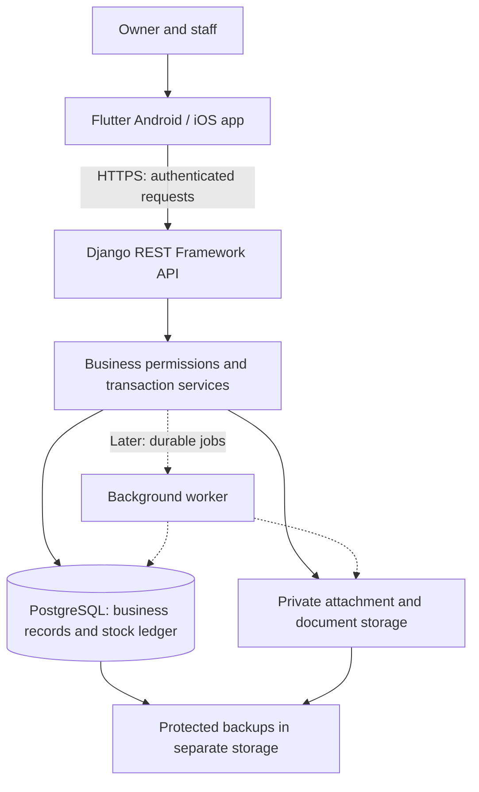

# Architecture

Status: The Flutter interface prototype is implemented. Analysis, 12 unit/widget tests, web and debug Android builds, APK signature verification, and interactive browser checks passed during prototype development. Physical Android hardware and iOS remain untested. Django REST Framework and PostgreSQL were confirmed as the backend and database on 2026-10-06. They, the authentication, and the deployment described below have not been implemented yet; [PLAN.md](../PLAN.md) sets the delivery order.

Product requirements live in [PRD.md](PRD.md), visual rules in [DESIGN_SYSTEM.md](DESIGN_SYSTEM.md), and development rules in [AGENTS.md](../AGENTS.md). This document describes how the agreed inventory ERP should fit together.

## System Overview

One shared Flutter application serves Android tablets first, then iPad and iPhone. Each business manages its own catalog, staff, stores, and warehouses. Staff devices connect to a central API; the server decides whether an operation is permitted and commits its effect on stock and financial records.

Proposed production system:



Start with a **modular monolith**: one backend application with separate business modules and one PostgreSQL database. This keeps a sale, its payment record, and its stock movements inside one database transaction. Separate microservices are unnecessary for the initial release.

Stock-changing actions require internet access. Optional cached views must show when they were last refreshed. An offline cart or saved draft must never appear to be a completed sale. Offline stock synchronization is outside the initial scope.

### What Runs Today

```text
Flutter widgets and shared theme
    ├── Generated Russian / Turkmen ARB strings
    ├── Custom Turkmen delegates for the toolkit controls used
    ├── SharedPreferences: selected interface language only
    └── DemoStore: sample catalog, balances, cart, and session operations
```

`DemoStore` is a local demonstration implementation. Business records live in memory and reset when the app restarts. It does not provide production persistence, authentication, permissions, accounting, or offline sales. Transfers complete immediately in the demo; production transfers must track dispatch, transit, and receipt separately. Warranty cards are sample records.

## Tech Stack

| Area | Technology or approach | Status |
| --- | --- | --- |
| Shared client | Flutter and Dart; Android tablets first, Apple platforms later | Confirmed; Android/web prototype present |
| Client toolchain | Flutter 3.47.6, pinned in `.flutter-version`; dependencies in `mobile/pubspec.lock` | Implemented |
| State and UI updates | `ChangeNotifier` and `AnimatedBuilder`, with shared theme/widgets | Implemented for the prototype |
| Localization | Flutter-generated ARB strings for `ru` and `tk`, custom Turkmen toolkit delegates, bundled Inter and Noto Serif | Implemented for current screens; terminology review pending |
| Local preferences | `SharedPreferences` for interface language | Implemented; never a stock database or token store |
| Backend | Python, Django, Django REST Framework | Confirmed (2026-10-06); not implemented |
| Database | PostgreSQL | Confirmed (2026-10-06); not implemented |
| Authentication | Django user accounts and business memberships; mobile access/refresh tokens through a maintained authentication library | Proposed; exact library and token policy to select during backend setup |
| Mobile session storage | Platform secure storage backed by Android Keystore / Apple Keychain | Planned; package not installed |
| Attachments and PDFs | Private file/object storage; server-generated documents with bundled fonts | Planned; provider and PDF library undecided |
| Background jobs | Celery with Redis if long-running imports, reports, or scheduled work require it | Future option; not needed to run the prototype |
| Monitoring | Structured server logs, health metrics, and error reporting | Planned; provider undecided |
| Payment handling | Record payment method and amounts; no payment gateway | Initial product scope |

Backend versions and dependencies must be pinned when that scaffold is created. No Django, PostgreSQL, Redis, authentication provider, or external service is currently connected to the app. Keep the existing client state approach unless a concrete workflow justifies changing it.

## Project Structure

### Existing Files

| Path | Responsibility |
| --- | --- |
| `mobile/lib/main.dart` | Startup, language preference, and localization delegates |
| `mobile/lib/demo/` | Sample records and in-memory demonstration operations |
| `mobile/lib/screens/` | Workspace navigation, dashboard, products/inventory, sales, and management screens |
| `mobile/lib/widgets/` | Shared visual components, dialogs, and display helpers |
| `mobile/lib/theme/` | Flutter theme and semantic colors |
| `mobile/lib/l10n/` | Russian/Turkmen ARB files, generated strings, and Turkmen adapters |
| `mobile/assets/fonts/` | Bundled fonts and licenses |
| `mobile/test/` | Demo behavior and widget tests |
| `mobile/android/` | Android host and checksum-pinned Gradle wrapper |
| `mobile/web/` | Browser host for reviewing the same Flutter interface |
| `scripts/` | Cloud tool activation and reproducible setup helpers |
| `docs/` | Product requirements, design system, and architecture |

The browser host supports development review. It does not introduce a separate desktop ERP product. An iOS host has not yet been generated.

### Proposed Additions

These paths are a plan, not existing directories. Add them as their workflows are implemented rather than creating empty abstractions in advance.

```text
mobile/lib/
    core/                   # API transport, session handling, common errors
    features/               # Feature models, repositories, controllers, screens
        catalog/
        inventory/
        purchasing/
        sales/
        ...

backend/
    config/                 # Django settings, URLs, environment configuration
    apps/
        businesses/         # Businesses, locations, memberships, permissions
        catalog/            # Products, barcodes, categories, brands, units
        inventory/          # Ledger, balances, transfers, counts, adjustments
        purchasing/         # Suppliers, purchase orders, deliveries, returns
        sales/              # Customers, sales, recorded payments, refunds
        expenses/           # Expense categories, entries, receipt links
        warranties/         # Entitlement snapshots and claim workflows
        reporting/          # Authorized reports and reorder calculations
        documents/          # Receipts, invoices, PDFs, attachment access
        imports/            # CSV validation, previews, application jobs
        audit/              # Activity history and operation identities
    tests/                  # Cross-module and PostgreSQL integration checks

infra/                      # Deployment configuration, added when selected
```

In the backend, API serializers validate request shape, application services coordinate business rules and transactions, and models/migrations define persistent records and constraints. Modules call services rather than independently changing inventory balances.

## Frontend and Localization

The client follows this boundary as production workflows are added:

```text
Screen → controller/state → feature repository → API client → server
```

Widgets display state and collect input. Repositories map server responses into typed models. The API client centralizes authentication, timeouts, pagination, and structured errors. Demo data remains explicitly separate from API-backed records; saving `DemoStore` balances into preferences is not a production persistence strategy.

- Show loading, empty, validation, success, and failure states. Disable duplicate submission while a command is pending.
- The server confirms a sale, receipt, transfer, or refund before the UI shows completion. A cart does not reserve stock in the initial model; checkout rechecks availability.
- Cache only appropriate reads initially, keyed by business, location, and user access. Clear private cache/session state on logout or account changes. Preserve drafts across language switching.
- Keep all system strings in Russian/Turkmen ARB resources. User-entered product names and identifiers remain unchanged when the interface language changes.
- Treat interface language, business currency, document language, and business timezone as separate settings. Store timestamps in UTC and report dates using the configured business timezone.
- Use decimal-safe parsing and explicit currency precision. The demo uses integer minor units and illustrative TMT amounts; production currency, rounding, and tax rules still require confirmation.
- Custom Turkmen delegates cover current controls because the pinned Flutter SDK lacks built-in `tk` delegates. Audit and extend them before adding date/time pickers: inherited English picker formatting is not approved for release.
- Review Russian/Turkmen terminology with fluent speakers and verify fonts in PDFs and printing as well as on screen.

## API and Data Flow

Use a versioned REST API, provisionally `/api/v1/`. Public resource identifiers should be stable, preferably UUIDs. Server-generated document numbers are separate from identifiers and follow the eventual business/legal numbering policy.

### Completing a Sale

1. Staff select an authorized location and add products to a cart. The client validates required input and displays an estimated total.
2. The client submits the sale command over HTTPS with authentication and a unique operation/idempotency key. It retains that key until the outcome is known.
3. The API verifies the session, business membership, location access, and permissions for prices, discounts, and payment recording. Client-supplied business IDs never establish access.
4. Inside a PostgreSQL transaction, the service claims the operation key, locks affected stock rows in a consistent order, rechecks quantities and current price/discount rules, and calculates authoritative totals.
5. The service creates the sale, item/price snapshots, recorded payments, stock movements, balance changes, and audit entry together. Any validation failure rolls the transaction back.
6. After commit, the API returns the finalized sale and updated values. The client updates the UI and offers the receipt. PDF generation can retry separately without completing another sale.

If the connection times out, the outcome may be unknown. Query the operation status or retry with the **same key**; a new key could create another sale. Idempotency records use a unique business/actor/action/key scope and a request fingerprint. Reusing a key with a different payload is rejected. Concurrent duplicate requests return one committed outcome.

### Reads and Errors

Lists support pagination, permitted location/date filters, and indexed search. Financial fields are filtered on the server, not merely hidden in the interface.

Return structured errors such as `code`, message parameters, field errors, and a request ID. The client translates error codes using its selected language. Distinguish validation errors, expired sessions, denied access, stock conflicts, and temporary service failures. Do not expose server tracebacks or another business's records.

## Database and Storage

### Main Records

| Domain | Principal records and relationships |
| --- | --- |
| Business access | Business, location, user, membership, role, permitted locations |
| Catalog | Product, category, brand, unit, barcode, product/location reorder settings |
| Inventory | Stock movement, stock balance by location and condition, transfer/items, count/items, approved adjustment |
| Purchasing | Supplier, purchase order/items, delivery/items, supplier return |
| Sales | Customer, sale/items, recorded payment, linked return/items, recorded refund |
| Expenses | Expense, category, location, private receipt attachment |
| Warranties | Sale-item warranty terms snapshot, claim, status history, resolution |
| Operations | Idempotency record, audit event, document metadata, import job |

Use foreign keys, tenant-aware relationships, and uniqueness constraints for identifiers such as business SKUs and barcodes. Every business-owned record carries a business scope; related products, locations, documents, and transactions must belong to that same business. Users may have separate memberships in several businesses.

A shared database with business-scoped records is the proposed first deployment. Authorization filters and relationship validation apply to API reads/writes, reports, downloads, imports, and jobs. Test isolation directly; adding a `business_id` column alone does not enforce it.

### Stock Ledger and Transaction Integrity

- The stock movement ledger is the historical source for inventory changes. Each entry identifies business, product, location/condition, quantity change, originating document, actor, and timestamp.
- Maintain current balance rows transactionally for fast availability checks. Reconcile them against the ledger; never allow an ordinary endpoint to overwrite a balance without an explained movement.
- Use PostgreSQL row locks, uniqueness/check constraints, and atomic transactions to prevent overselling and duplicate posting. Lock rows in a consistent order and test competing requests against PostgreSQL.
- Finalized transactions and movements retain history. Corrections create linked reversals or adjustments. Application permissions prevent ordinary users from rewriting posted history.
- Sellable, damaged, awaiting-inspection, and in-transit quantities remain distinct. Only sellable stock is available for sales; negative availability is disallowed initially.
- Purchase orders do not increase stock. Actual receipts do, including partial deliveries; retain remaining quantities and prevent duplicate receipt posting.
- A transfer dispatch removes source availability and records goods in transit. Receipt adds the actual received quantity at the destination and reduces transit quantity. Cancellation and discrepancies require explicit transitions and reasons.
- Counts retain their baseline, measurement times, and movement/version context. Detect movements during counting and require reconciliation or a defined movement pause before approval. Never blindly overwrite the latest balance with an earlier count. The pilot's exact count policy remains to be selected.
- Returns lock and validate the original sale items so concurrent requests cannot exceed remaining returnable quantities. Refund amounts follow the original discounts/taxes and approved policy. Only goods accepted as sellable replenish availability.
- Warranty terms are copied onto finalized sale items. Later catalog edits must not change an existing entitlement; a replacement or other stock effect posts through the inventory service.

### Money, Reports, and Files

Store money using PostgreSQL decimal/numeric fields and Python `Decimal`, with explicit currency and rounding rules. Send API monetary values as decimal strings; clients must not convert them through binary floating-point arithmetic. Choose quantity precision according to product units rather than assuming every future item is an integer piece.

Sale lines preserve price, discount, tax, exchange rate, and applicable warranty snapshots. Inventory costing is **FIFO** (decided 2026-10-06): each receipt or opening-stock line creates a cost layer with its own unit cost, and selling or writing off consumes the oldest layer first, so every outflow movement records its exact cost. Revenue, gross profit, expenses, and net profit are separate measures. This product does not initially provide a full accounting ledger.

**Currency (decided 2026-10-06).** The business currency is TMT (2 decimals, rounded half up). A product's selling price may be stated in TMT or USD; a USD price is converted to TMT at the most recent exchange rate entered by an owner or manager (append-only rate history), and the rate and converted price are snapshotted on the sale line. Purchase costs, payments, totals, stock values and reports are always in TMT.

Store attachment metadata in PostgreSQL and file content in private storage. Check business permissions before upload/download and use short-lived authorized access where supported. Validate file size/type and keep generated reports private. PDFs must embed fonts supporting both required languages. Expensive report generation can become a background job as volume grows.

CSV imports first stage and validate data, preview duplicates/errors, then apply approved rows through defined transactional batches. Record batch outcomes and retry identities so interruptions cannot silently duplicate or partially alter records. Product imports must not change stock outside the inventory workflow. Exports respect permissions and escape spreadsheet formula content.

## Authentication and Permissions

Use server-managed accounts and memberships, with owner, manager, sales, and warehouse permissions as defined in the PRD. The API checks both the action and allowed locations for every request. Django administration, if enabled, is a separate restricted operator tool.

The recommended mobile approach uses short-lived access tokens and revocable, rotating refresh sessions through a maintained library. Store refresh credentials in platform secure storage; keep server credentials out of the app. Define expiry, rotation/reuse detection, logout revocation, password reset, and audit behavior before release. Do not invent a custom token protocol.

Rate-limit sign-in and sensitive endpoints. Audit important changes with actor, business, location, action, record reference, time, and request ID; omit credentials and sensitive payloads. Permission changes must take effect on the server even if the client still displays cached navigation.

## External Services and Hardware

| Integration | Initial approach | Work still required |
| --- | --- | --- |
| Authentication | Django accounts; no Clerk/Firebase dependency assumed | Select maintained token library and recovery workflow |
| Payment gateway | None; record payments and refunds | A gateway is a separate future scope decision |
| Email | Password-recovery codes through any SMTP service configured by environment settings (decided 2026-10-06) | Choose the provider (D16) and test delivery from Turkmenistan; tests use an in-memory email backend. SMS is not planned |
| Barcode scanning | Tablet camera is the agreed first method (decided 2026-10-06), with manual entry as a fallback | Verify camera scanning on the pilot tablet; USB/Bluetooth scanners are an optional later step |
| Receipt/label printing | Optional device integration; generated documents planned | Select printer/protocol and test Russian/Turkmen glyphs |
| File and backup storage | Private storage with separate protected backups | Select provider, retention, and restore procedures |
| Error monitoring | Server metrics/logs first; optional hosted error tracker | Select provider and redact business data |

A barcode lookup maps to an authorized product search; it does not bypass sale or inventory validation. Keep a manual-entry fallback. Do not promise compatibility with arbitrary scanners or printers.

Provider availability and API connectivity must be tested from the pilot's network in Turkmenistan. No payment, email, analytics, storage, or monitoring vendor has been chosen. Server-side integration secrets belong in deployment configuration, never in Flutter assets.

## Deployment

### Development Today

The Codex cloud environment runs the Flutter development workflow and an internal web smoke server. It is not the production hosting environment. Setup/run commands are in [README.md](../README.md); the reusable cloud installation/startup configuration is saved separately. Retained SDKs and caches can be reused, but live services must restart after an environment is restored.

### Proposed Production Deployment

Begin with a containerized Django API on a suitable Linux host or managed application platform, a persistent PostgreSQL database, and private attachment storage. Use a production application server behind an HTTPS reverse proxy. The exact provider, region, and capacity remain undecided.

Keep development, staging, and production separate, with different secrets and databases. Expose only the HTTPS application endpoint; databases and any future Redis service remain private. Select storage and database hosting together with backup and restore requirements.

Deploy pinned dependencies through CI: run relevant tests, build the API image, review/apply database migrations, deploy, and check API/database readiness. Use backward-compatible API/schema changes while older mobile releases remain installed. Application rollback must account for migrations and must not rely on restoring over active production data.

Android pilot builds need a stable application identifier and protected release signing keys; the current example identifier and debug signature are development defaults. Choose the pilot distribution channel before commercial release. Generate the iOS host, configure signing, and validate iPad/iPhone behavior during the Apple stage using macOS/Xcode or a suitable build service.

### Backup and Recovery

Back up PostgreSQL records and private attachments into separate protected storage. Choose frequency, retention, acceptable data loss (RPO), and acceptable recovery time (RTO) with the pilot business. Add point-in-time database recovery if those targets require it.

Monitor backup failures and test restoration into a separate environment. Verify representative businesses, stock ledger/balances, sales/returns, permissions, and attachments after recovery. CSV exports are not a substitute for backups. Production restoration remains a controlled administrator operation.

## Scalability and Operations

Index common queries by business, product, location, status, and date. Paginate lists and use PostgreSQL queries for the initial reports. Start with one API deployment; add API replicas, connection pooling, and database capacity based on measured load.

Add Redis caching only for demonstrated read bottlenecks. Include business and access scope in cache keys, invalidate after relevant commits, and never use cached quantities to authorize checkout. The database remains authoritative.

Move lengthy imports, PDFs, and scheduled tasks to workers when needed. Persist job identities and make retries safe. If a committed transaction requires follow-up work, use a database outbox or another durable handoff so a crash between commit and enqueue cannot lose it. Workers must apply the same business permissions and boundaries as API services.

Track request latency/errors, database locks and slow queries, job failures, storage usage, stock reconciliation differences, and backup outcomes. Use request IDs to trace failures without logging credentials or customer payloads. Operator health checks cover the API and its dependencies; they do not replace business workflow tests.

## Validation and Delivery

Existing prototype validation establishes that the development interface runs. It does not establish production backend correctness, hardware compatibility, release readiness, or iOS support.

The production implementation should follow the PRD stages:

1. Build business isolation, authentication/permissions, catalog, locations, purchases/receiving, and sales/receipts. Introduce API repositories one workflow at a time.
2. Add transfers, counts, reorder suggestions, returns/refunds, with explicit states and conflict handling.
3. Add expenses, warranties, imports/exports, reports/activity review, and tested backup recovery for the pilot.
4. Validate and release the shared client for iPad/iPhone, including platform-specific hardware behavior.

Backend checks must cover cross-business and role denial, atomic rollback, concurrent sales, retries/timeouts, partial receiving, transfer states, concurrent returns, count conflicts, decimal rounding, authorized file access, imports, and restoration. Run concurrency checks against PostgreSQL. Test localized screens and documents in both languages and scanning/printing on the selected real hardware.

### Decisions Still Open

| Decision | Resolve before |
| --- | --- |
| Backend dependency versions, token library, API contracts | Implementing backend/client integration |
| Invoice numbering and local tax/document requirements (currency and rounding were decided 2026-10-06) | Finalizing production sales and documents |
| Count reconciliation policy (FIFO costing was decided 2026-10-06) | Stock counts |
| Refund/adjustment approvals and warranty terms | Finalizing those workflows |
| Pilot tablet, scanning method, printer, approved translations | Pilot acceptance |
| Hosting/storage provider, backup retention, RPO/RTO | Production deployment |
| Distribution channel, app identifiers, Android/Apple signing | Mobile release |

These decisions do not block documenting the architecture or continuing the foundation. The relevant workflow must resolve them before it is finalized for release.
